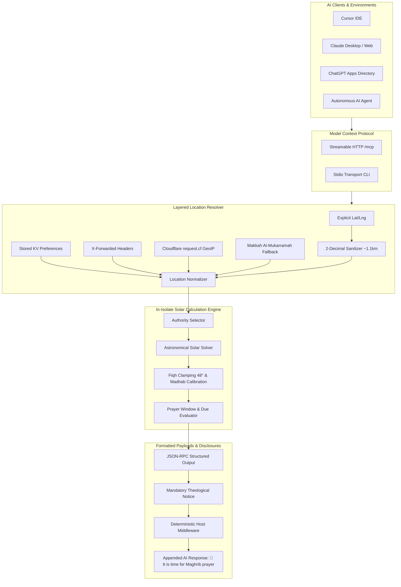

<p align="center">
  <a href="https://github.com/tareq7/muslim-prayer-mcp">
    
  </a>
</p>

<h1 align="center">🕌 Muslim Prayer Reminder MCP</h1>

<p align="center">
  <strong>Production-ready astronomical prayer calculation and proactive notification engine on Cloudflare Workers for AI models, coding agents, and developer environments.</strong>
</p>

<p align="center">
  <a href="https://tareq7.github.io/muslim-prayer-mcp/"><strong>Documentation</strong></a> •
  <a href="https://tareq7.github.io/muslim-prayer-mcp/demo.mp4"><strong>Live Demo (1080p)</strong></a> •
  <a href="#-quick-start"><strong>Quick Start</strong></a> •
  <a href="#-mcp-tools-catalog"><strong>Tools Catalog</strong></a> •
  <a href="#-astronomical--theological-rigor"><strong>Theological Rigor</strong></a> •
  <a href="SECURITY.md"><strong>Security Policy</strong></a>
</p>

<p align="center">
  <a href="https://github.com/tareq7/muslim-prayer-mcp/actions/workflows/ci.yml"></a>
  <a href="https://github.com/tareq7/muslim-prayer-mcp/releases"></a>
  <a href="https://github.com/tareq7/muslim-prayer-mcp/actions"></a>
  <a href="https://registry.modelcontextprotocol.io/v0.1/servers?search=io.github.tareq7/muslim-prayer-mcp"></a>
  <a href="https://glama.ai/mcp/servers/tareq7/muslim-prayer-mcp"></a>
  <a href="SECURITY.md"></a>
  <a href="LICENSE"></a>
</p>

> **Project Status**: 🟢 **Actively Maintained (v1.0.1)**  
> Supported across Cloudflare Workers, Node.js 22/24 (Ubuntu & Windows), and all Model Context Protocol (MCP) clients.

---

## ⚡ Quick Start

### 1. Run via NPX (Zero Installation)
Add to your Claude Desktop, Cursor, or VS Code MCP configuration:
```json
{
  "mcpServers": {
    "muslim-prayer": {
      "command": "npx",
      "args": ["-y", "muslim-prayer-mcp"]
    }
  }
}
```

### 2. Connect via Remote Streamable HTTP (Cloudflare Workers)
```json
{
  "mcpServers": {
    "muslim-prayer": {
      "url": "https://muslim-prayer-mcp.najetareqz.workers.dev/mcp"
    }
  }
}
```

### 3. 1-Click Install in Cursor
[](cursor://anysphere.cursor-deeplink/mcp/install?name=muslim-prayer&url=https%3A%2F%2Fmuslim-prayer-mcp.najetareqz.workers.dev%2Fmcp)

---

## 📺 Live Video Demonstration

Watch the Muslim Prayer Reminder MCP in action inside ChatGPT, Claude, and Cursor:

<p align="center">
  <a href="https://tareq7.github.io/muslim-prayer-mcp/demo.mp4">
    
  </a>
  <br />
  <em>👉 <a href="https://tareq7.github.io/muslim-prayer-mcp/demo.mp4"><strong>Click here to watch the full 1080p demo video (MP4)</strong></a></em>
</p>

---

## 🏛️ System Architecture



---

## 🛠️ MCP Tools Catalog

The server exposes 5 finely-tuned tools conforming to the latest Model Context Protocol standard with full Zod output contracts:

| Tool Name | Operation Mode | Open World | Description |
| :--- | :--- | :--- | :--- |
| **`get_prayer_status`** | Read-Only | Safe | Checks if an obligatory prayer is currently due. Returns active prayer, countdown, calculation authority, and selection justification. |
| **`get_today_prayer_times`** | Read-Only | Safe | Computes today's full timetable (Fajr, Sunrise, Dhuhr, Asr, Maghrib, Isha) in UTC and localized string format. |
| **`get_next_prayer`** | Read-Only | Safe | Returns the immediate upcoming prayer, exact scheduled timestamp, countdown minutes, and regional authority. |
| **`search_cities`** | Read-Only | Safe | Fuzzy search across 100+ global Islamic metropolitan areas with pre-calibrated coordinates, timezones, and authorities. |
| **`list_authorities`** | Read-Only | Safe | Enumerates all recognized Islamic calculation authorities, twilight angles, and regional jurisdictions. |

---

## 📐 Astronomical & Theological Rigor

Prayer calculations are not approximations—they represent exact solar depression angles calibrated to regional fatwa bodies:

| Sovereign Authority | Jurisdiction | Fajr Angle | Isha Angle / Interval | Default Asr Madhab |
| :--- | :--- | :--- | :--- | :--- |
| **Umm al-Qura University** | Saudi Arabia, GCC | 18.5° | +90 min (+120 min Ramadan) | Shafi / Standard |
| **Egyptian General Survey** | Egypt, Palestine, Levant | 19.5° | 17.5° | Shafi *(Palestinian Awqaf offsets applied)* |
| **Diyanet İşleri Başkanlığı** | Turkey, Balkans, Central Asia | 18.0° | 17.0° | Hanafi (Double shadow ratio) |
| **Univ. of Islamic Sciences, Karachi** | Pakistan, India, Bangladesh | 18.0° | 18.0° | Hanafi (Double shadow ratio) |
| **ISNA** | United States, Canada | 15.0° | 15.0° | Shafi / Standard |
| **Muslim World League (MWL)** | Europe, Global Fallback | 18.0° | 17.0° | Shafi / Standard |
| **MABIMS / JAKIM / MUIS** | Malaysia, Singapore, Indonesia | 20.0° | 18.0° | Shafi / Standard |

### High-Latitude Polar Adjustments
In latitudes above 48° North or South where twilight persists throughout the night in summer, the engine automatically engages fiqh-compliant clamping (**Middle of the Night** & **One-Seventh Rule**), preventing computational errors or impossible timetables.

---

## 🔌 Client Installation Matrix

| Client | Mode | Config Snippet / Deeplink |
| :--- | :--- | :--- |
| **Cursor** | Remote HTTP | [](cursor://anysphere.cursor-deeplink/mcp/install?name=muslim-prayer&url=https%3A%2F%2Fmuslim-prayer-mcp.najetareqz.workers.dev%2Fmcp) |
| **Claude Desktop** | Stdio CLI | Add `"command": "npx", "args": ["-y", "muslim-prayer-mcp"]` to `claude_desktop_config.json` |
| **Windsurf / Devin** | Remote HTTP | Add URL `https://muslim-prayer-mcp.najetareqz.workers.dev/mcp` to `mcp_config.json` |
| **VS Code / Copilot** | Local / NPX | Add `"command": "npx", "args": ["-y", "muslim-prayer-mcp"]` to `.vscode/mcp.json` |
| **Docker** | Container | `docker run -d -p 8080:8080 ghcr.io/tareq7/muslim-prayer-mcp:latest` |
| **AI Agents (Code/SDK)** | All Modes | See [AGENTS.md](AGENTS.md) and [SKILL.md](skills/muslim-prayer-mcp/SKILL.md) |

---

## 💻 Deterministic Host Middleware

For platforms building autonomous AI agents (Next.js, LangChain, Vercel AI SDK), the included middleware deterministically appends prayer notices to AI responses without hallucination:

```typescript
import { PrayerReminderMiddleware } from 'muslim-prayer-mcp/middleware';

const prayerMiddleware = new PrayerReminderMiddleware({
  workerBaseUrl: 'https://muslim-prayer-mcp.najetareqz.workers.dev',
  userId: 'user_session_42',
});

// Wrap any LLM completion
const rawLlmOutput = await callLlm('Can you review this pull request?');
const { responseText, reminderAppended } = await prayerMiddleware.processResponse(rawLlmOutput, {
  'X-User-Coordinates': '24.71, 46.68', // Riyadh
  'X-User-Timezone': 'Asia/Riyadh',
});

console.log(responseText);
// => The code looks solid, but let's optimize line 42...
//
// 🕌 It is time for Asr prayer.
```

---

## 🧪 Comprehensive Test Suite

The engine includes 44 unit, integration, and end-to-end tests validating astronomical accuracy across 10 worldwide benchmark coordinates:

```bash
npm test
```

```
▶ Astronomical Prayer Calculation Suite
  ✔ calculates valid prayer timetable for Riyadh in correct chronological sequence
  ✔ calculates valid prayer timetable for Makkah in correct chronological sequence
  ✔ calculates valid prayer timetable for Cairo in correct chronological sequence
  ✔ calculates valid prayer timetable for Dubai in correct chronological sequence
  ✔ calculates valid prayer timetable for London in correct chronological sequence
  ✔ calculates valid prayer timetable for Paris in correct chronological sequence
  ✔ calculates valid prayer timetable for New York in correct chronological sequence
  ✔ calculates valid prayer timetable for Jakarta in correct chronological sequence
  ✔ calculates valid prayer timetable for Karachi in correct chronological sequence
  ✔ calculates valid prayer timetable for Sydney (Southern Hem) in correct chronological sequence
  ✔ verifies Hanafi Asr is strictly later than Shafi Asr
  ✔ handles Daylight Saving Time (DST) transitions safely
  ✔ automatically resolves Palestinian Awqaf standard for Gaza
  ✔ handles high-latitude polar city with MiddleOfTheNight rule safely
...
ℹ tests 44 | pass 44 | fail 0
```

---

## 🔒 Security & Privacy Policy

* **Coordinate Truncation**: All user coordinates are truncated to 2 decimal places upon arrival (~1.1 km resolution). Precise location is mathematically non-recoverable.
* **No Outbound Tracking**: Astronomical math is computed locally within the isolated V8 runtime; zero external requests are made to third-party tracking APIs.
* **Fail-Open Architecture**: Host middleware is designed to fail open; network issues or latency spikes will never block primary AI conversation streams.
* **Full Disclosure Process**: See [SECURITY.md](SECURITY.md) for supported versions, SLA, and private reporting.

---

## 📄 Governance, Citations & Community

* **License**: [MIT License](LICENSE)
* **Citation**: [CITATION.cff](CITATION.cff)
* **Maintainers**: [MAINTAINERS.md](MAINTAINERS.md)
* **Governance**: [GOVERNANCE.md](GOVERNANCE.md)
* **Product Roadmap**: [ROADMAP.md](ROADMAP.md)
* **Agent Guidelines**: [AGENTS.md](AGENTS.md)
* **Contributing**: [CONTRIBUTING.md](CONTRIBUTING.md)
* **Code of Conduct**: [CODE_OF_CONDUCT.md](CODE_OF_CONDUCT.md)
* **Discussions**: [GitHub Discussions](https://github.com/tareq7/muslim-prayer-mcp/discussions)

<p align="center">
  Made with precision for the global Muslim developer community.
</p>
