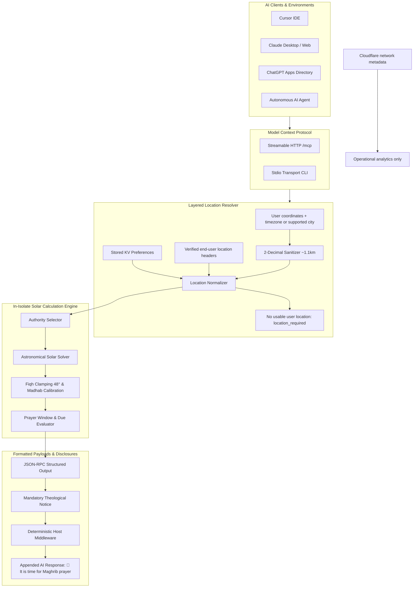

<p align="center">
  <a href="https://github.com/tareq7/muslim-prayer-mcp">
    
  </a>
</p>

<h1 align="center">🕌 Muslim Prayer Reminder MCP</h1>

<p align="center">
  <strong>Production-ready astronomical prayer calculation and proactive notification engine on Cloudflare Workers for AI models, coding agents, and developer environments.</strong>
</p>

<p align="center">
  <a href="https://tareq7.github.io/muslim-prayer-mcp/"><strong>Documentation</strong></a> •
  <a href="https://tareq7.github.io/muslim-prayer-mcp/demo.mp4"><strong>Live Demo (1080p)</strong></a> •
  <a href="#-quick-start"><strong>Quick Start</strong></a> •
  <a href="#-mcp-tools-catalog"><strong>Tools Catalog</strong></a> •
  <a href="#-astronomical--theological-rigor"><strong>Theological Rigor</strong></a> •
  <a href="SECURITY.md"><strong>Security Policy</strong></a>
</p>

<p align="center">
  <a href="https://github.com/tareq7/muslim-prayer-mcp/actions/workflows/ci.yml"></a>
  <a href="https://github.com/tareq7/muslim-prayer-mcp/releases"></a>
  <a href="https://github.com/tareq7/muslim-prayer-mcp/actions"></a>
  <a href="https://registry.modelcontextprotocol.io/v0.1/servers?search=io.github.tareq7/muslim-prayer-mcp"></a>
  <a href="https://glama.ai/mcp/servers/tareq7/muslim-prayer-mcp"></a>
  <a href="https://m8ven.ai/mcp/tareq7/muslim-prayer-mcp"></a>
  <a href="https://wellknown.network/agents/muslim-prayer-reminder-mcp"></a>
  <a href="https://github.com/Smart-Creations"></a>
  <a href="SECURITY.md"></a>
  <a href="LICENSE"></a>

</p>

> **Project Status**: 🟢 **Actively Maintained (v1.0.1)**  
> **Published by**: [**Smart Creations**](https://github.com/Smart-Creations) (OpenAI Org: `org-deULP4GGInsTcWmuaHWp3lxy`) • **Lead Maintainer**: [**Tareq Naji**](https://github.com/tareq7)  
> Supported across Cloudflare Workers, Node.js 22/24 (Ubuntu & Windows), and all Model Context Protocol (MCP) clients.


---

## ⚡ Quick Start

### 1. Run via NPX (Zero Installation)
Add to your Claude Desktop or Cursor MCP configuration:
```json
{
  "mcpServers": {
    "muslim-prayer": {
      "command": "npx",
      "args": ["-y", "muslim-prayer-mcp"]
    }
  }
}
```

### 2. Connect via Remote Streamable HTTP (Cloudflare Workers)
```json
{
  "mcpServers": {
    "muslim-prayer": {
      "url": "https://muslim-prayer-mcp.najetareqz.workers.dev/mcp"
    }
  }
}
```

### 3. 1-Click Install in Cursor
[](cursor://anysphere.cursor-deeplink/mcp/install?name=muslim-prayer&url=https%3A%2F%2Fmuslim-prayer-mcp.najetareqz.workers.dev%2Fmcp)

---

## 📺 Live Video Demonstration

Watch the Muslim Prayer Reminder MCP in action inside ChatGPT, Claude, and Cursor:

<p align="center">
  <a href="https://tareq7.github.io/muslim-prayer-mcp/demo.mp4">
    
  </a>
  <br />
  <em>👉 <a href="https://tareq7.github.io/muslim-prayer-mcp/demo.mp4"><strong>Click here to watch the full 1080p demo video (MP4)</strong></a></em>
</p>

---

## 🏛️ System Architecture


```mermaid
flowchart TD
    subgraph ClientLayer ["AI Clients & Environments"]
        Cursor["Cursor IDE"]
        Claude["Claude Desktop / Web"]
        ChatGPT["ChatGPT Apps Directory"]
        Agent["Autonomous AI Agent"]
    end

    subgraph TransportLayer ["Model Context Protocol"]
        HTTP["Streamable HTTP /mcp"]
        Stdio["Stdio Transport CLI"]
    end

    subgraph ResolverLayer ["Layered Location Resolver"]
        Explicit["User coordinates + timezone or supported city"] --> Truncate["2-Decimal Sanitizer ~1.1km"]
        UserPref["Stored KV Preferences"] --> Resolver["Location Normalizer"]
        Headers["Verified end-user location headers"] --> Resolver
        Resolver --> Missing["No usable user location: location_required"]
        Truncate --> Resolver
    end

    GeoIP["Cloudflare network metadata"] --> Analytics["Operational analytics only"]

    subgraph EngineLayer ["In-Isolate Solar Calculation Engine"]
        Resolver --> Authority["Authority Selector"]
        Authority --> AdhanEngine["Astronomical Solar Solver"]
        AdhanEngine --> FiqhRules["Fiqh Clamping 48° & Madhab Calibration"]
        FiqhRules --> DueLogic["Prayer Window & Due Evaluator"]
    end

    subgraph OutputLayer ["Formatted Payloads & Disclosures"]
        DueLogic --> MCPResponse["JSON-RPC Structured Output"]
        MCPResponse --> DisclosureNotice["Mandatory Theological Notice"]
        DisclosureNotice --> Middleware["Deterministic Host Middleware"]
        Middleware --> FinalOutput["Appended AI Response: 🕌 It is time for Maghrib prayer"]
    end

    ClientLayer --> TransportLayer
    TransportLayer --> ResolverLayer
```

---

## 🛠️ MCP Tools Catalog

The server exposes 5 finely-tuned tools conforming to the latest Model Context Protocol standard with full Zod output contracts:

| Tool Name | Operation Mode | Open World | Description |
| :--- | :--- | :--- | :--- |
| **`get_prayer_status`** | Temporary state write | Safe | Checks if an obligatory prayer is currently due. Returns active prayer, countdown, calculation authority, and selection justification. |
| **`get_today_prayer_times`** | Read-Only | Safe | Computes today's full timetable (Fajr, Sunrise, Dhuhr, Asr, Maghrib, Isha) in UTC and localized string format. |
| **`get_next_prayer`** | Read-Only | Safe | Returns the immediate upcoming prayer, exact scheduled timestamp, countdown minutes, and regional authority. |
| **`configure_prayer_preferences`** | Overwrites saved settings (`destructiveHint: true`) | Safe | Updates supplied preferences; switching fixed location can clear the previous location and timezone. Previous values are not retained for undo. |
| **`get_prayer_preferences`** | Read-Only | Safe | Reads saved public preference settings. |

---

## 📐 Astronomical & Theological Rigor

Prayer calculations use astronomical models and configured regional methods; high-latitude substitutes and geographic heuristics are disclosed:

| Sovereign Authority | Jurisdiction | Fajr Angle | Isha Angle / Interval | Default Asr Madhab |
| :--- | :--- | :--- | :--- | :--- |
| **Umm al-Qura University** | Saudi Arabia | 18.5° | +90 min | Shafi / Standard |
| **Egyptian General Survey** | Egypt, Palestine, Levant | 19.5° | 17.5° | Shafi *(configured Palestinian service offsets applied)* |
| **Diyanet İşleri Başkanlığı** | Turkey, Balkans, Central Asia | 18.0° | 17.0° | Hanafi (Double shadow ratio) |
| **Univ. of Islamic Sciences, Karachi** | Pakistan, India, Bangladesh | 18.0° | 18.0° | Hanafi (Double shadow ratio) |
| **ISNA** | United States, Canada | 15.0° | 15.0° | Shafi / Standard |
| **Muslim World League (MWL)** | Europe, Global Fallback | 18.0° | 17.0° | Shafi / Standard |
| **Configured Singapore method** | Malaysia, Singapore, Indonesia | 20.0° | 18.0° | Shafi / Standard |

### High-Latitude Polar Adjustments
In latitudes above 48° North or South where twilight persists throughout the night in summer, the engine automatically engages fiqh-compliant clamping (**Middle of the Night** & **One-Seventh Rule**), preventing computational errors or impossible timetables.

---

## 🔌 Install & Multi-Agent Setup

Connect Muslim Prayer Reminder to any AI agent harness, developer IDE, or container runtime:

### 1-Click & Matrix Overview

| Environment / Harness | Protocol Mode | Quick Command / Deeplink |
| :--- | :--- | :--- |
| **Cursor IDE** | Remote HTTP | [](cursor://anysphere.cursor-deeplink/mcp/install?name=muslim-prayer&url=https%3A%2F%2Fmuslim-prayer-mcp.najetareqz.workers.dev%2Fmcp) |
| **Claude Code** | Native Plugin | `/plugin marketplace add tareq7/muslim-prayer-mcp` |
| **Codex** | Native Plugin | `codex plugin marketplace add tareq7/muslim-prayer-mcp` |
| **GitHub Copilot CLI** | Copilot Plugin | `copilot plugin marketplace add tareq7/muslim-prayer-mcp` |
| **Claude Desktop** | Stdio CLI | `npx -y muslim-prayer-mcp` via `claude_desktop_config.json` |
| **VS Code & Cline** | Local NPX | `npx -y muslim-prayer-mcp` via `.vscode/mcp.json` |
| **Windsurf & Devin** | Remote HTTP | Remote URL to `mcp_config.json` |
| **Gemini CLI** | Native Extension | `gemini mcp add --transport http muslim-prayer https://muslim-prayer-mcp.najetareqz.workers.dev/mcp` |
| **Pi Agent Harness** | Git Extension | `pi install git:github.com/tareq7/muslim-prayer-mcp` |
| **OpenCode** | Agent Plugin | Auto-loaded via `opencode.json` & `AGENTS.md` |
| **Docker Container** | Container | `docker build -t muslim-prayer-mcp .` then `docker run --rm -i muslim-prayer-mcp` (stdio) |

---

### Claude Code

Run inside your Claude Code session:

```bash
/plugin marketplace add tareq7/muslim-prayer-mcp
/plugin install muslim-prayer-mcp@muslim-prayer-mcp
```

*(Note: Send as two separate prompts). In the **Claude Code Desktop app**, click the **+** button next to the prompt box ➔ **Plugins** ➔ **Add plugin** to browse and install from the marketplace.*

---

### Codex

Run in your terminal:

```bash
codex plugin marketplace add tareq7/muslim-prayer-mcp
codex plugin add muslim-prayer-mcp@muslim-prayer-mcp
```

*Run `codex` and open `/hooks` (or start a new thread). This also activates the plugin in the Codex Desktop app upon restart.*

---

### GitHub Copilot CLI

In your terminal:

```bash
copilot plugin marketplace add tareq7/muslim-prayer-mcp
copilot plugin install muslim-prayer-mcp@muslim-prayer-mcp
```

Or inside an interactive Copilot CLI session:

```text
/plugin marketplace add tareq7/muslim-prayer-mcp
/plugin install muslim-prayer-mcp@muslim-prayer-mcp
```

---

### Cursor IDE

Click to install with one click:  
[](cursor://anysphere.cursor-deeplink/mcp/install?name=muslim-prayer&url=https%3A%2F%2Fmuslim-prayer-mcp.najetareqz.workers.dev%2Fmcp)

Or manually add to `.cursor/mcp.json`:

```json
{
  "mcpServers": {
    "muslim-prayer": {
      "url": "https://muslim-prayer-mcp.najetareqz.workers.dev/mcp"
    }
  }
}
```

---

### Claude Desktop

Add to your `claude_desktop_config.json`:

```json
{
  "mcpServers": {
    "muslim-prayer": {
      "command": "npx",
      "args": ["-y", "muslim-prayer-mcp"]
    }
  }
}
```

---

### VS Code & Cline

Add this to `.vscode/mcp.json` using [VS Code's `servers` format](https://code.visualstudio.com/docs/agent-customization/mcp-servers):

```json
{
  "servers": {
    "muslim-prayer": {
      "type": "stdio",
      "command": "npx",
      "args": ["-y", "muslim-prayer-mcp"]
    }
  }
}
```

Cline settings use the `mcpServers` format shown in Quick Start.

---

### Windsurf & Devin

Add to `mcp_config.json`:

```json
{
  "mcpServers": {
    "muslim-prayer": {
      "url": "https://muslim-prayer-mcp.najetareqz.workers.dev/mcp"
    }
  }
}
```

---

### Gemini CLI

Connect directly using the live edge endpoint:

```bash
gemini mcp add --transport http muslim-prayer https://muslim-prayer-mcp.najetareqz.workers.dev/mcp
```

---

### Pi Agent Harness

```bash
pi install git:github.com/tareq7/muslim-prayer-mcp
```

---

### OpenCode

Add to your `opencode.json`:

```json
{
  "$schema": "https://opencode.ai/config.json",
  "mcp": {
    "muslim-prayer": {
      "type": "remote",
      "url": "https://muslim-prayer-mcp.najetareqz.workers.dev/mcp"
    }
  }
}
```

*OpenCode automatically loads this repository's [`AGENTS.md`](AGENTS.md) and [`skills/muslim-prayer-mcp/SKILL.md`](skills/muslim-prayer-mcp/SKILL.md).*

---

### Docker Container

```bash
docker build -t muslim-prayer-mcp .
docker run --rm -i muslim-prayer-mcp
```

---

## 💻 Deterministic Host Middleware

For platforms building autonomous AI agents (Next.js, LangChain, Vercel AI SDK), the included middleware deterministically appends prayer notices to AI responses without hallucination:

```typescript
import { PrayerReminderMiddleware } from 'muslim-prayer-mcp/middleware';

const prayerMiddleware = new PrayerReminderMiddleware({
  workerBaseUrl: 'https://muslim-prayer-mcp.najetareqz.workers.dev',
  userId: 'user_session_42',
});

// Wrap any LLM completion
const rawLlmOutput = await callLlm('Can you review this pull request?');
const { responseText, reminderAppended } = await prayerMiddleware.processResponse(rawLlmOutput, {
  'X-User-Coordinates': '24.71, 46.68', // Riyadh
  'X-User-Timezone': 'Asia/Riyadh',
});

console.log(responseText);
// => The code looks solid, but let's optimize line 42...
//
// 🕌 It is time for Asr prayer.
```

---

## 🧪 Comprehensive Test Suite

The engine includes 44 unit, integration, and end-to-end tests validating astronomical accuracy across 10 worldwide benchmark coordinates:

```bash
npm test
```

```
▶ Astronomical Prayer Calculation Suite
  ✔ calculates valid prayer timetable for Riyadh in correct chronological sequence
  ✔ calculates valid prayer timetable for Makkah in correct chronological sequence
  ✔ calculates valid prayer timetable for Cairo in correct chronological sequence
  ✔ calculates valid prayer timetable for Dubai in correct chronological sequence
  ✔ calculates valid prayer timetable for London in correct chronological sequence
  ✔ calculates valid prayer timetable for Paris in correct chronological sequence
  ✔ calculates valid prayer timetable for New York in correct chronological sequence
  ✔ calculates valid prayer timetable for Jakarta in correct chronological sequence
  ✔ calculates valid prayer timetable for Karachi in correct chronological sequence
  ✔ calculates valid prayer timetable for Sydney (Southern Hem) in correct chronological sequence
  ✔ verifies Hanafi Asr is strictly later than Shafi Asr
  ✔ handles Daylight Saving Time (DST) transitions safely
  ✔ automatically resolves Palestinian Awqaf standard for Gaza
  ✔ handles high-latitude polar city with MiddleOfTheNight rule safely
...
ℹ tests 44 | pass 44 | fail 0
```

---

## 🔒 Security & Privacy Policy

* **Coordinate Truncation**: All user coordinates are truncated to 2 decimal places upon arrival (~1.1 km resolution). Precise location is mathematically non-recoverable.
* **No Outbound Tracking**: Astronomical math is computed locally within the isolated V8 runtime; zero external requests are made to third-party tracking APIs.
* **Fail-Open Architecture**: Host middleware is designed to fail open; network issues or latency spikes will never block primary AI conversation streams.
* **Full Disclosure Process**: See [SECURITY.md](SECURITY.md) for supported versions, SLA, and private reporting.

---

## 📄 Governance, Ownership & Community

* **Publisher & Organization**: [**Smart Creations**](https://github.com/Smart-Creations) (OpenAI Organization ID: `org-deULP4GGInsTcWmuaHWp3lxy`)
* **Lead Maintainer & Author**: **Tareq Naji** ([@tareq7](https://github.com/tareq7))

* **License**: [MIT License](LICENSE) (Copyright © 2026 Smart Creations & Tareq Naji)
* **Citation**: [CITATION.cff](CITATION.cff)
* **Maintainers**: [MAINTAINERS.md](MAINTAINERS.md)
* **Governance**: [GOVERNANCE.md](GOVERNANCE.md)
* **Product Roadmap**: [ROADMAP.md](ROADMAP.md)
* **Agent Guidelines**: [AGENTS.md](AGENTS.md)
* **Contributing**: [CONTRIBUTING.md](CONTRIBUTING.md)
* **Code of Conduct**: [CODE_OF_CONDUCT.md](CODE_OF_CONDUCT.md)
* **Discussions**: [GitHub Discussions](https://github.com/tareq7/muslim-prayer-mcp/discussions)


<p align="center">
  Made with precision for the global Muslim developer community.
</p>

### Verified location and calculation disclosures (v1.1.0)

Prayer tools accept a supported `city`, coordinates with `timezone`, or complete stored fixed settings. Missing location returns `location_required`; connector/IP geolocation and automatic Makkah fallback are not used. Explicit per-call inputs override fixed preferences. Host headers must represent the end user.

`highLatitudeAdjustment` discloses twilight substitutions and polar clamping; `effectiveLatitude` is present only for the +/-48-degree substitute and never echoes the original coordinate. `calculationDetails` reports location basis and regional, user, and method offsets. Invalid offsets that reverse prayer windows return `invalid_calculation`. Preferences expose `fixedCoordinatesConfigured` and `fixedCityConfigured` while redacting coordinates.

Analytics is pseudonymous and approximate: daily buckets 60 days, subject hashes 90 days, sessions 7 days, aggregate counters without expiry. Counts are not global atomic delivery metrics. Both dashboard aliases honor configured service authentication. See the privacy policy for the full retention and trust boundaries.

### Preference and display-time contracts

Explicit coordinates require `timezone` in the same request. Stored fixed-location timezones are never inherited for new explicit coordinates. `calculationDetails.timezoneSource` identifies explicit, city, stored, or host input; explicit display timezones are not geographically validated.

Fixed mode requires a supported city or coordinates with timezone. New fixed coordinates require timezone in the same configuration request. Failed configuration updates save nothing. Switching to `auto_travel` preserves fixed location for reuse; `clearFixedLocation:true` removes city, coordinates and timezone and defaults to auto-travel, preserving unrelated preferences. Clear cannot accompany replacement location/timezone or incomplete fixed mode.

For identified users, `prayer_window` and `exact_window` emit once per prayer/date/mode; `persistent` emits throughout the prayer period. Locale changes and toggling reminders do not reset deduplication. Anonymous calls do not persist deduplication. `expiresAtUtc` retains its prayer-period meaning; `prayerWindowExpiresAtUtc` names the same boundary, and `reminderWindowExpiresAtUtc` describes eligibility, capped by the prayer boundary in exact mode. These fields appear when a reminder is emitted. Cross-region KV updates and deduplication remain best effort.

The Palestinian regional profile is a configured service heuristic using the Egyptian method with Dhuhr -1 and Maghrib +3 minute offsets. Its broad coordinate/timezone/country rules do not establish jurisdiction. Exact adoption of these parameters by the Palestinian ministry has not been verified from a primary source. Users can override method and offsets. Other regional choices are service defaults, not nationwide mandates. Method descriptions follow [Adhan documentation](https://github.com/batoulapps/adhan-js/blob/develop/METHODS.md).

The supported city vocabulary and aliases are advertised in each location input schema and generated skill. The service registers five tools only. Duplicate suffixed tools or old schemas in a connector require refreshing its registration; they are not separate server operations.
